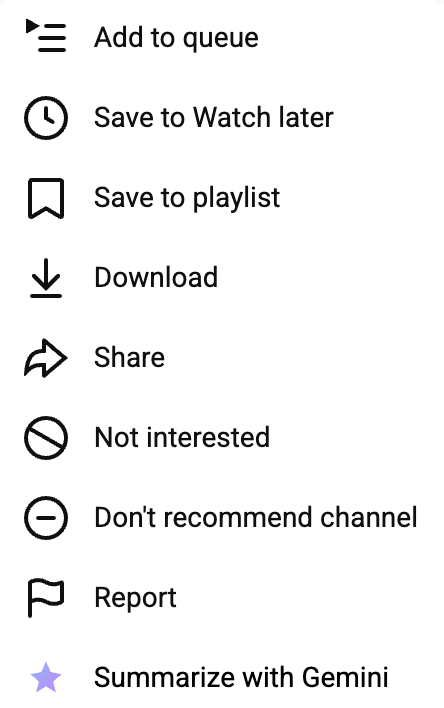
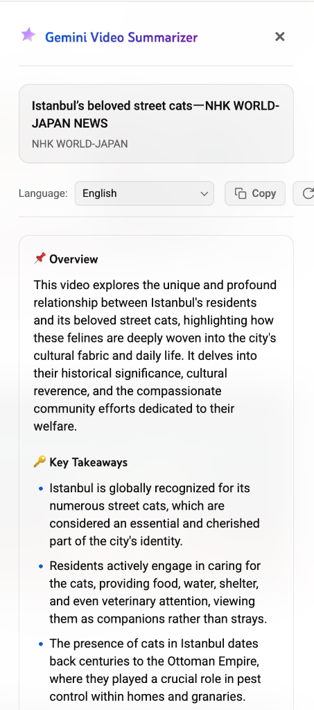

# Gemini YouTube Video Summarizer 🚀✨

[](https://developer.chrome.com/docs/extensions/mv3/)
[](https://deepmind.google/technologies/gemini/)
[](https://opensource.org/licenses/MIT)

A premium, high-fidelity Google Chrome extension that injects a **"Summarize with Gemini"** tool directly into YouTube's native UI. Grasp core video insights instantly in a beautiful glassmorphic slide-over panel, and ask conversational, context-aware Q&A follow-up questions about the entire video without leaving your screen.

<p align="center">
  &nbsp;&nbsp;&nbsp;&nbsp;&nbsp;&nbsp;&nbsp;&nbsp;&nbsp;&nbsp;&nbsp;&nbsp;
  
</p>

---

## 🎨 Premium Features

*   **Native UI Integration:** Seamlessly inserts a custom "Summarize with Gemini" action item directly into YouTube's dynamic 3-dots menus (supporting both modern `yt-list-view-model` components and legacy Polymer listboxes).
*   **Interactive Conversational Q&A:** A state-preserved, multi-turn chat assistant at the bottom of the summary page. Ask questions about the whole video (especially details not covered in the overview) and ask follow-up questions with full thread memory context.
*   **YouTube Native Typography Sizing:** Built with strict adherence to YouTube's design metrics. Styled in `"Roboto"` and `"YouTube Sans"` with exact pixel sizes and neutral colors to look like a native, organic platform feature.
*   **100% Client-Side Captions Pipeline:** Scrapes the watch page, securely resolves subtitle tracks, and merges timing cues to send clear transcripts without complex server dependencies.
*   **Robust Metadata Fallback:** In case captions are disabled or unavailable, it automatically parses video descriptions and metadata to produce an intelligent overview.
*   **Dynamic Self-Healing Fallbacks:** Future-proofed model catalog resolution. In case `gemini-1.5-flash` is missing on your API key or region, the extension automatically queries your available Google models, resolves the best Flash/Pro alternative, and retries seamlessly in the background.
*   **Multi-lingual Support:** Instantly switches and generates summaries or answers in **Turkish (Türkçe)**, **English**, **Spanish (Español)**, **German (Deutsch)**, **French (Français)**, **Russian (Русский)**, and **Portuguese (Português)**.
*   **Clipboard Ready:** Copy the fully formatted markdown summaries with a single click.

---

## 🛠️ Installation & Setup (Developer Mode)

To run the extension locally in your Chrome browser:

1.  **Clone the Repository:**
    ```bash
    git clone https://github.com/buraki/youtube-video-summarizer-gemini.git
    cd youtube-video-summarizer-gemini
    ```
2.  **Open Chrome Extensions:**
    *   Open Chrome and navigate to: `chrome://extensions/`
3.  **Enable Developer Mode:**
    *   Toggle the **"Developer mode"** switch in the top-right corner.
4.  **Load Unpacked Extension:**
    *   Click the **"Load unpacked"** (Paketlenmemiş Yükle) button in the top-left.
    *   Select the root directory of this project (`calm-carson` or the cloned repository folder).

---

## ⚙️ Configuration & Usage

1.  **Obtain a Free Gemini API Key:**
    *   Head to **[Google AI Studio](https://aistudio.google.com/)** and click **"Get API Key"** to generate a free token in seconds.
2.  **Save the Key:**
    *   Click the **Gemini YouTube Video Summarizer** action icon in your Chrome toolbar.
    *   Enter your API Key, toggle the visibility eye icon if needed, select your default preferred summary language, and click **Save**. *(The extension will run a live connection check to Google to verify the key is valid before saving!)*
3.  **Summarize a Video:**
    *   Open YouTube and browse to any feed (Home, Search, Channel, or Sidebar).
    *   Click the **3-dots menu button** on any video card or watch page controller.
    *   Select **"Summarize with Gemini"** (with the custom Sparkle logo).
    *   Watch the real-time progress steps complete and read your summary or chat with the video!

---

## 🔒 Permissions Declared

We minimize data access to ensure high-grade user privacy. The extension requests:
-   `storage`: To securely save your API Key and language preferences locally across synced Chrome accounts.
-   `*://*.youtube.com/*`: To inject menus and retrieve caption tracks locally on-site.
-   `*://generativelanguage.googleapis.com/*`: To send secure, client-side queries directly to Google Gemini API servers.

---

## 📦 Technology Stack

-   **Frontend Architecture:** Modern, pure Vanilla JavaScript (ES6+), HTML5, and CSS3.
-   **Security Model:** Chrome Extensions Manifest V3 (MV3), utilizing secure background service workers for API requests and strictly sandboxed local scripting.
-   **AI Engine:** Google Gemini API (`v1/models/gemini-1.5-flash`).

---

## 📄 License

This project is licensed under the MIT License. See [LICENSE](LICENSE) or the repository disclosures for more details.
